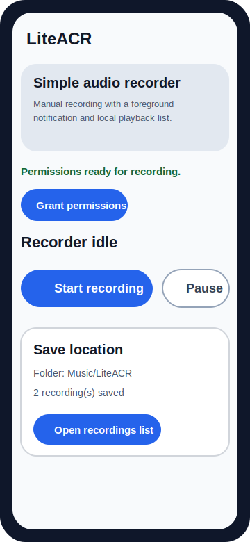
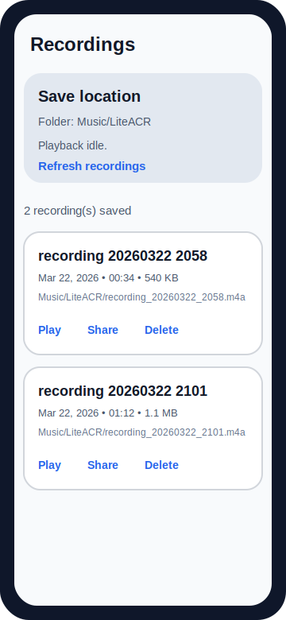
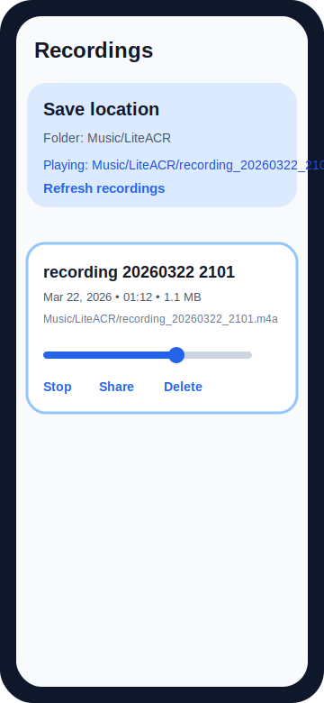

# LiteACR

LiteACR is a simple Android voice recorder built for manual recording on modern Android devices.

It records from the microphone, keeps a foreground notification active while recording, and stores finished files in `Music/LiteACR` so they are easy to find from the Files app.

## Screenshots

<p>
  
  
  
</p>

## Features

- start, stop, pause, and resume recording
- shared storage output in `Music/LiteACR`
- separate recordings screen with in-app playback
- share and delete actions for saved files
- Android 13 notification-permission support

## Install

Requirements:

- Android 10 or newer (`minSdk 29`)
- microphone permission
- notification permission on Android 13+

Install options:

1. Download the latest APK from the [GitHub Releases page](https://github.com/tanik-kumar/liteacr-voice-recorder/releases)
2. Transfer the APK to the phone if needed
3. Open the APK and allow `Install unknown apps` for the app you used to open it
4. Launch LiteACR and grant microphone and notification permissions

## Storage

Saved recordings are written to:

`Music/LiteACR`

The app also shows the active folder path on the main screen and on the recordings screen.

## Permissions

- `RECORD_AUDIO` - required to capture microphone audio
- `POST_NOTIFICATIONS` - required on Android 13+ so the foreground recording notification stays visible
- foreground service permissions - required so recording can continue while the app is backgrounded

## Privacy

- recordings stay on the device unless you explicitly share them
- LiteACR does not upload recordings to a server
- LiteACR does not require an account

Full privacy notes are in `PRIVACY.md`.

## Limitations

- LiteACR is a manual microphone recorder, not a phone-call recorder
- on modern Android, third-party apps cannot reliably capture both sides of a cellular call
- recording quality depends on the device microphone, ROM behavior, and background limits

## Build

Requirements:

- Android Studio or Android SDK command-line tools
- JDK 17
- Android SDK 34

Debug build:

```bash
./gradlew assembleDebug
```

Release build:

```bash
./gradlew assembleRelease
```

## Release signing

The release build supports local signing through `keystore.properties`.

1. Copy `keystore.properties.example` to `keystore.properties`
2. Point `storeFile` to your `.jks` file
3. Fill in the passwords and alias
4. Run `./gradlew assembleRelease`

Sensitive files are ignored through `.gitignore`:

- `keystore.properties`
- `keystore/`

Back up your release keystore before publishing updates. You need the same key for future app updates.

## Contributing

Contribution guidance is in `CONTRIBUTING.md`.

## Known issues and roadmap

Current limitations and planned improvements are tracked in `ROADMAP.md`.

## Changelog

Release history is tracked in `CHANGELOG.md`.

## License

This project is licensed under the MIT License. See `LICENSE`.

## GitHub About

Suggested repo description and topics are in `docs/github-about.md`.

## Release notes

Release notes for published versions are in `release-notes/`.
